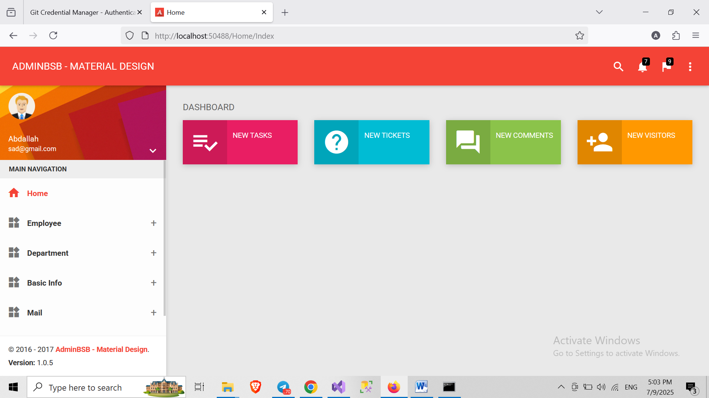
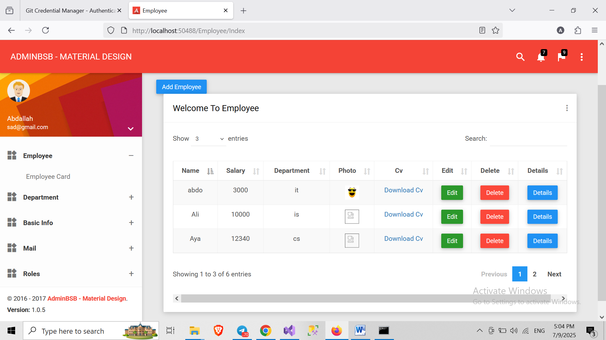
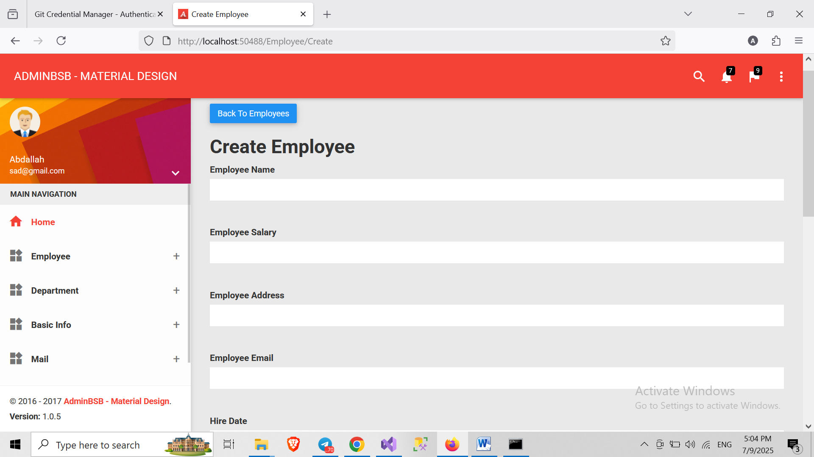
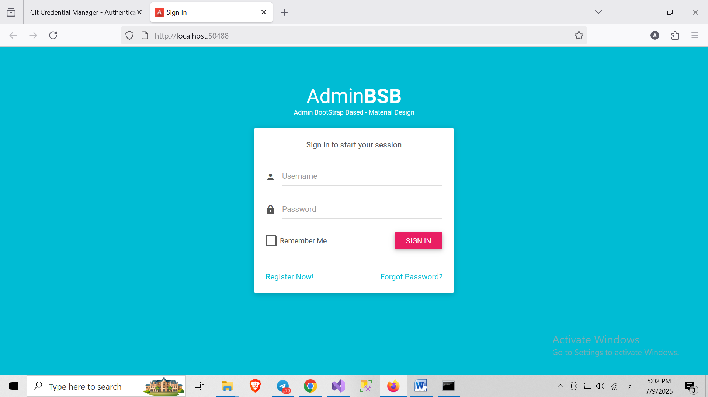
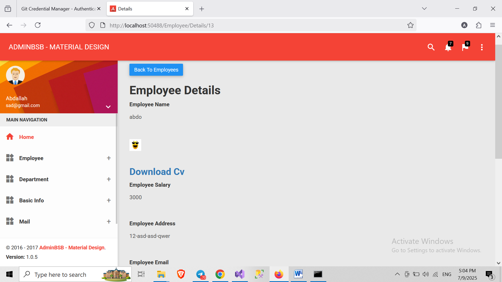
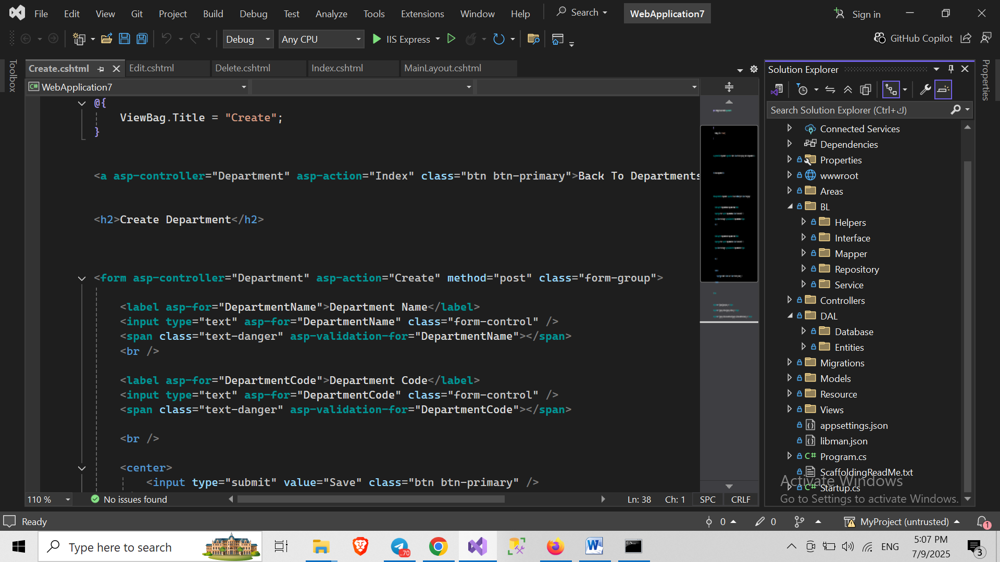

# Employee Management System

A full-stack ASP.NET Core MVC application for managing employees and departments with CRUD operations, authentication, and RESTful API.

---

## 🛠️ Features

- Employee and Department CRUD
- Image upload
- Form validation
- Authentication
- RESTful API using ASP.NET Core Web API

---

## 📸 Screenshots

### 🏠 Home Page

### 📋 Employee List

### ➕ Add Employee

### 🔐 Login Page

### 🔁 Details

### 📋 Solutoin

---

## 🔗 GitHub Repository
[https://github.com/Abdallah-200/Employee-Management-System](https://github.com/Abdallah-200/Employee-Management-System)
